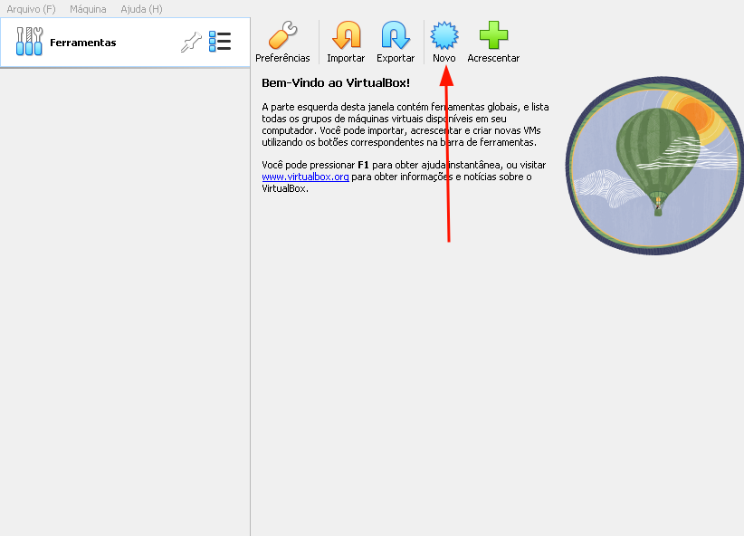
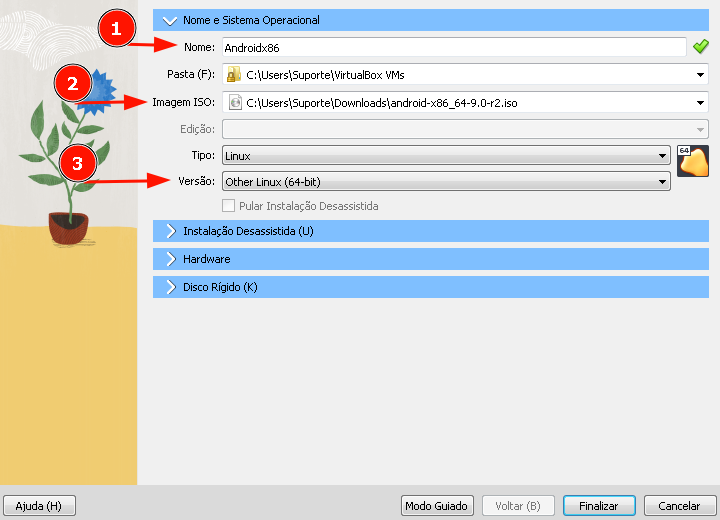
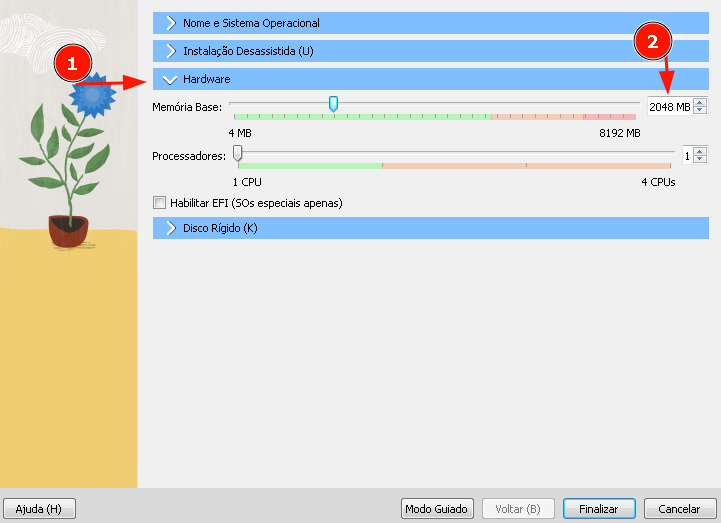
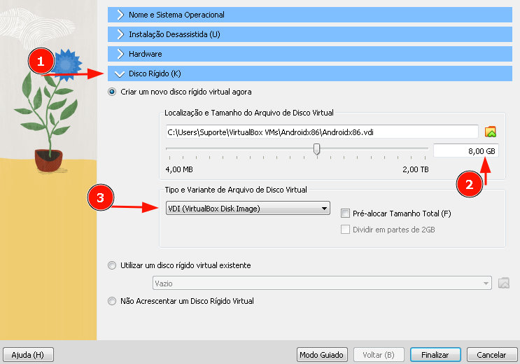
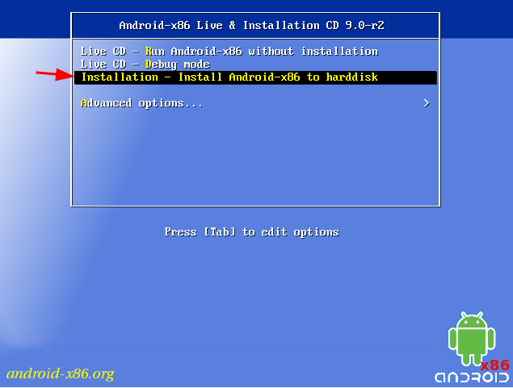

Esse é um projeto Android-x86 de código aberto gratuito que permite executar o Android em sistemas operacionais computador desktop.

Baixe e instale o VirtualBox em seu computador a partir do site oficial: https://www.virtualbox.org/

Baixe uma imagem ISO do Android-x86. Recomenda-se baixar a versão mais recente disponível no site oficial: https://www.android-x86.org/.

Abra o VirtualBox e clique em “Novo” para criar uma nova máquina virtual.

## Nome e Sistema Operacional

Na janela de criação, dê um nome para a máquina virtual e selecione “Linux” como tipo e “Other Linux (64-bit)” como versão, dependendo da imagem do Android-x86 que você baixou.

## Hardware

Defina a quantidade de memória RAM que deseja alocar para a máquina virtual. Recomenda-se pelo menos 2 GB para um desempenho adequado.

## Disco Rígido (K)

Defina o tamanho do disco rígido virtual. Recomenda-se um mínimo de 8 GB para a instalação do Android. Selecione “Disco rígido” e escolha o tipo de disco “VDI (VirtualBox Disk Image)” e finalize as configurações.

Agora você pode iniciar a máquina virtual clicando em “Iniciar”.

No menu de inicialização do Android-x86, escolha a opção “Installation – Install Android-x86 to harddisk”.

Siga as instruções na tela para particionar o disco virtual, formatá-lo e instalar o Android-x86.

Após a conclusão da instalação, reinicie a máquina virtual.

Agora você deverá ver a tela de inicialização do Android-x86. Siga as configurações iniciais, como selecionar o idioma e configurar uma conta Google, se desejar.

Pronto! Agora você tem o Android instalado e em execução no VirtualBox. Você pode explorar e experimentar o sistema operacional Android no ambiente virtualizado. Lembre-se de que o desempenho pode variar dependendo das especificações do seu computador e da configuração da máquina virtual.