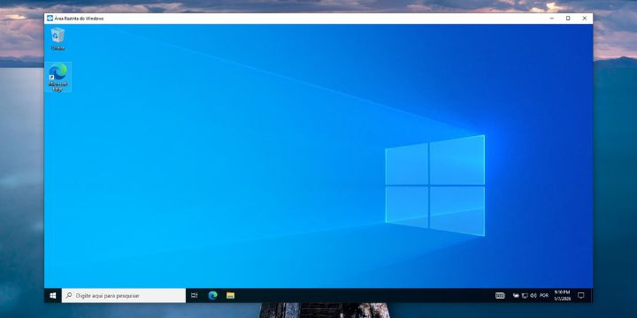
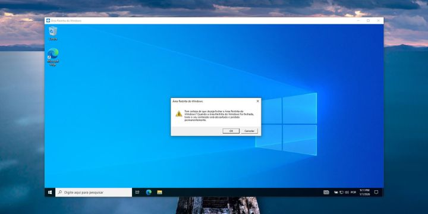

A Sandbox do Windows é uma ferramenta útil que permite executar aplicativos em um ambiente isolado, protegendo seu sistema principal de possíveis ameaças.

Um ambiente Sandbox é uma ferramenta poderosa que permite testar e executar aplicativos de forma isolada, sem afetar o sistema operacional principal. Aqui estão algumas coisas que você pode fazer com uma Sandbox:

- Testar Software Desconhecido
- Navegação Segura
- Desenvolvimento e Testes
- Treinamento e Aprendizado
- Isolamento de Tarefas Sensíveis
- Experimentos com Configurações do Sistema

### Passo 1: Verifique os Requisitos do Sistema
Antes de ativar a Sandbox, certifique-se de que seu sistema atende aos seguintes requisitos:  
- Windows 10 Pro, Enterprise ou Education (versão 1903 ou superior) ou Windows 11.
- Virtualização habilitada na BIOS/UEFI.
- Pelo menos 4 GB de RAM e 1 GB de espaço em disco.

### Passo 2: Habilitar a Sandbox do Windows
- Abra o Painel de Controle
- Pressione Windows + R, digite control e pressione Enter.
- Acesse Programas e Recursos
- Clique em “Programas” e depois em “Ativar ou desativar recursos do Windows”. 
- Ative a Sandbox do Windows: Na lista de recursos, procure por “Windows Sandbox”.
- Marque a caixa ao lado e clique em “OK”. 
- Reinicie o Computador: O Windows solicitará que você reinicie o computador para aplicar as alterações.

### Passo 3: Usar a Sandbox do Windows

- Digite “Windows Sandbox” na barra de pesquisa do menu Iniciar e clique no aplicativo.
- Uma vez aberta, você pode copiar e colar arquivos ou baixar aplicativos diretamente na Sandbox.

A Sandbox do Windows é projetada para ser um ambiente isolado, o que significa que ela tem limitações em termos de comunicação com a máquina hospedeira. Por padrão, a Sandbox não permite que você faça ping diretamente para a máquina hospedeira ou que ela se comunique com a rede local da mesma forma que um aplicativo normal faria.

Se você precisa de um ambiente de virtualização que permita mais interações de rede, pode ser interessante considerar outras soluções de virtualização, como o VirtualBox, Proxmox ou o VMware, que oferecem mais flexibilidade nesse aspecto.

Lembre-se: Tudo que você faz na Sandbox é temporário. Quando você fecha a Sandbox, todos os dados e alterações são apagados, então, se precisar salvar algo, faça isso antes de fechar.