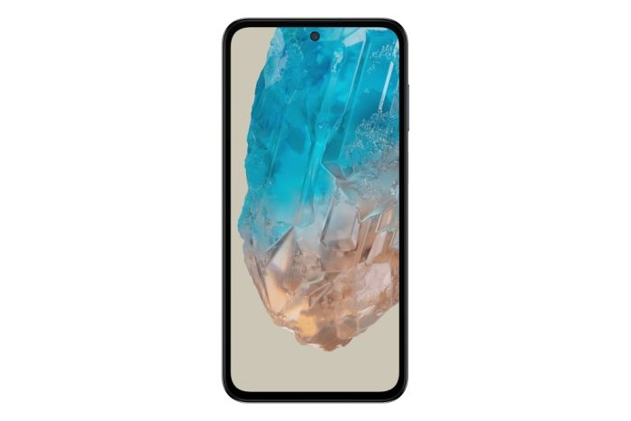
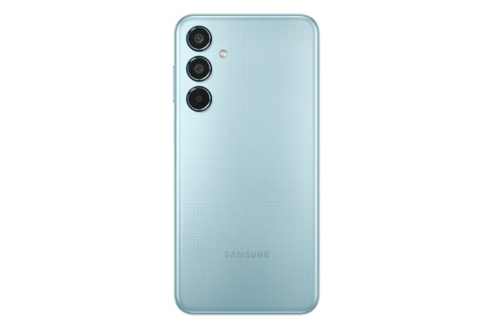

Após cinco anos utilizando o Xiaomi Mi A3, decidi que era hora de uma mudança. Embora tenha sido um ótimo smartphone, com um desempenho sólido e uma câmera que atendeu às minhas necessidades, a tecnologia avança rapidamente e eu sentia que estava na hora de explorar novas possibilidades. Foi então que me deparei com o Samsung Galaxy M35, um dispositivo que promete trazer uma série de melhorias e recursos interessantes.

Irei compartilhar minha experiência com o Galaxy M35 até agora, destacando as principais características que me chamaram a atenção. Desde a qualidade da câmera até a duração da bateria, quero oferecer uma visão completa sobre o que esperar desse novo smartphone. Se você está pensando em fazer uma troca que une desempenho e custo benefício, continue lendo!

## Design e Tela

O Galaxy M35 apresenta um design moderno e elegante, com uma tela Super AMOLED de 6,6 polegadas que oferece cores vibrantes e excelente contraste. A resolução Full HD+ (1080 x 2240 pixels) garante uma experiência visual imersiva, ideal para assistir a vídeos, jogar e navegar nas redes sociais. O display é protegido por Gorilla Glass, o que aumenta sua durabilidade e resistência a arranhões.

## Desempenho Poderoso

Equipado com um processador Exynos 1380, o Galaxy M35 proporciona um desempenho fluido e eficiente. Com opções de 8 GB RAM, o smartphone é capaz de lidar com multitarefas e aplicativos pesados sem engasgos. Além disso, a capacidade de armazenamento interno de 256 GB, expansível via cartão microSD, permitindo que os usuários armazenem fotos, vídeos e aplicativos sem preocupações.

## Câmeras de Alta Qualidade

Um dos destaques do Galaxy M35 é seu sistema de câmeras. Na parte traseira, encontramos uma câmera principal de 50 MP, acompanhada por uma lente ultra-angular de 8 MP e um sensor de profundidade de 5 MP. Essa configuração permite capturar imagens nítidas e detalhadas, além de fotos com efeito bokeh. A câmera frontal de 13 MP é perfeita para selfies e videochamadas, garantindo qualidade em todas as suas interações.

## Bateria Duradoura

A autonomia é um ponto forte do Galaxy M35, que conta com uma bateria de 6000 mAh. Essa capacidade impressionante garante que o dispositivo dure o dia todo, mesmo com uso intenso. Além disso, o smartphone suporta carregamento rápido de 25W, permitindo que você recarregue a bateria rapidamente e volte a usar seu dispositivo sem longas esperas.

## Software e Conectividade

O Galaxy M35 vem com o sistema operacional Android 14, com a interface One UI 6.1 da Samsung, que oferece uma experiência de usuário intuitiva e personalizável. Em termos de conectividade, o dispositivo suporta 5G, Wi-Fi, Bluetooth 5.0, GPS e NFC, garantindo que você esteja sempre conectado.

## Minhas Considerações Finais

O Samsung Galaxy M35 é uma excelente opção para quem busca um smartphone com bom desempenho, câmeras de qualidade e uma bateria duradoura, tudo isso a um preço acessível. Com suas especificações robustas e design atraente, ele se destaca no mercado de smartphones intermediários. Se você está em busca de um dispositivo que atenda às suas necessidades diárias sem comprometer o orçamento, o Galaxy M35 merece sua atenção.